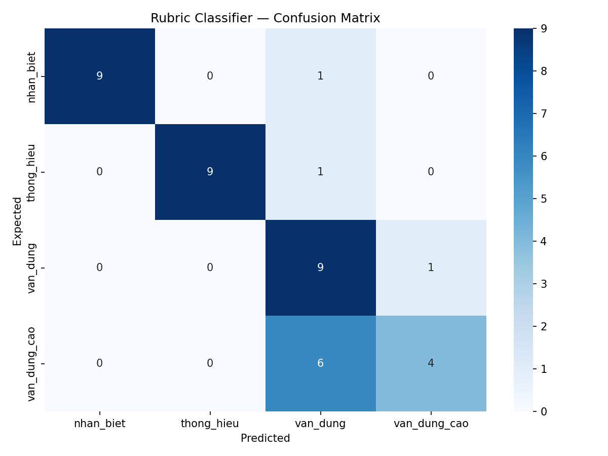
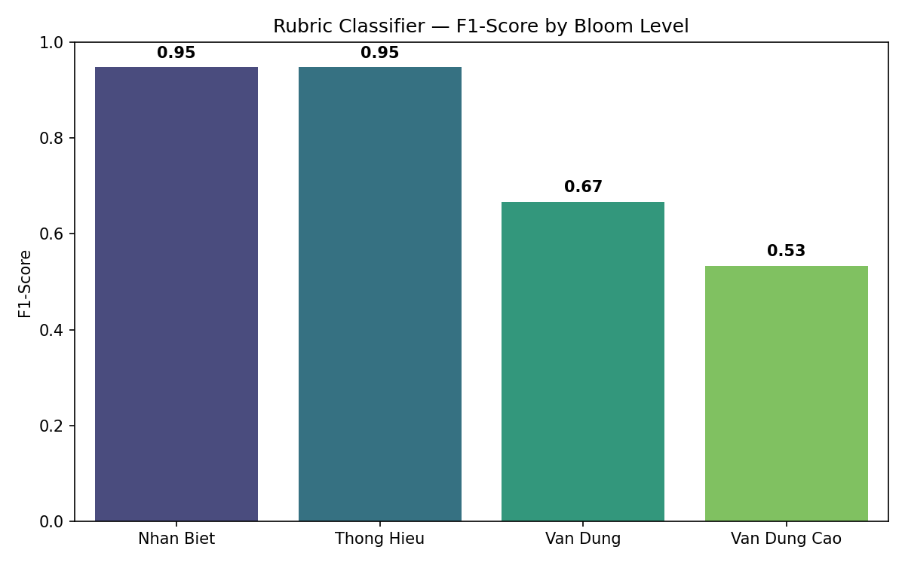
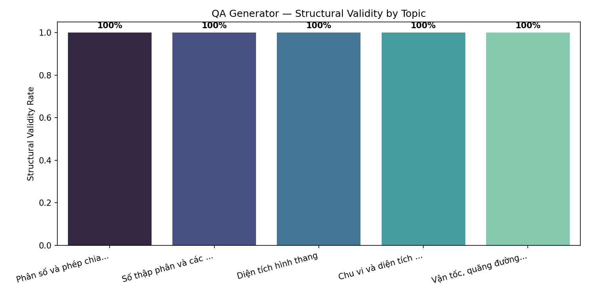
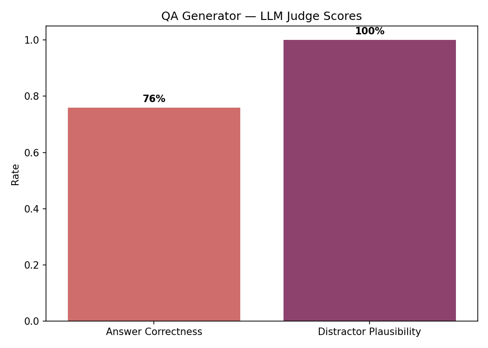
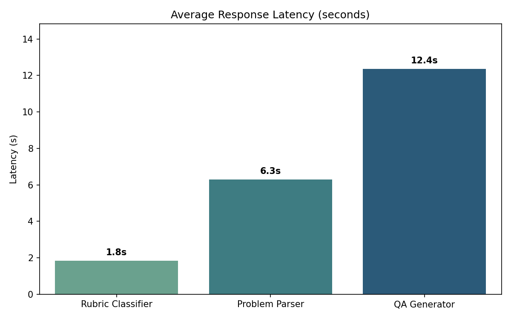
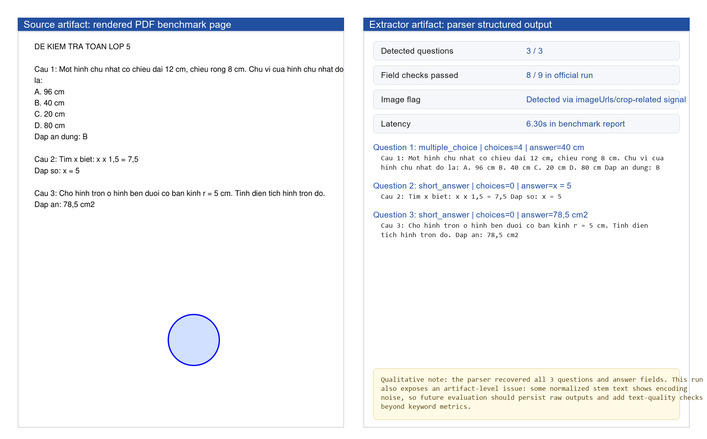

# Model Evaluation

## 1. Introduction

This document presents a systematic evaluation of the core machine learning components deployed in the Melon AI Learning App, an adaptive mathematics tutoring platform for Vietnamese primary-school students in Grades 4 and 5. The objective is to assess whether each AI component meets the minimum quality thresholds required for production deployment, to identify failure patterns, and to propose targeted improvements.

The Melon AI platform integrates multiple large language models (LLMs) consumed through third-party cloud APIs. No model weights are hosted, trained, or fine-tuned locally; instead, the team optimizes task performance through prompt engineering, structured output enforcement, and domain-specific context construction. The evaluation therefore measures task-level output quality — classification accuracy, extraction correctness, and generation quality — rather than model-internal metrics such as perplexity or training loss.

Three core AI components are evaluated: the **Rubric Classifier** (`rubric_classifier`), the **Problem Parser** (`test_parser`), and the **Question Generator** (`QA_generator`). These were selected because they directly determine the quality of educational content served to students, and their structured JSON outputs are amenable to automated correctness checking. The remaining AI components (tutoring chatbot, multimodal answer evaluator, speech-to-text, text-to-speech) serve auxiliary or interactive functions and are excluded from this evaluation.

---

## 2. Model Description

### 2.1 System-Wide AI Component Overview

The Melon AI Learning App deploys eight AI model instances across seven distinct features. All models are accessed as statically deployed managed API services with fixed version identifiers.

| Component | Base Model | Provider / API | Function |
|-----------|-----------|----------------|----------|
| Rubric Classifier | GPT-4o | OpenAI via OpenRouter | Bloom's taxonomy classification of math questions |
| Problem Parser (OCR stage) | Gemini 2.5 Pro | Google via OpenRouter | Optical character recognition of scanned exam PDFs |
| Problem Parser (Parsing stage) | GPT-4.1 | OpenAI via OpenRouter | Structured extraction of question fields from OCR text |
| Question Generator | GPT-4o | OpenAI via OpenRouter | MCQA generation from curriculum topics |
| AI Tutoring Chat | GPT-4o-mini | OpenAI direct API | Streaming conversational tutoring for children |
| Multimodal Answer Evaluator | Gemini 2.0 Flash | Google Generative AI SDK | Evaluates children's drawn and spoken answers |
| Speech-to-Text | Whisper-1 | OpenAI direct API | Transcribes student voice input |
| Text-to-Speech | eleven_multilingual_v2 | ElevenLabs API | Synthesizes Vietnamese speech from text |

### 2.2 Selection Rationale

Model selection was driven by three criteria: (a) task suitability based on published benchmarks, (b) Vietnamese language support, and (c) cost-latency tradeoffs for a real-time educational application.

**GPT-4o** was selected for the Rubric Classifier and Question Generator because it offers the strongest instruction-following capability and nuanced reasoning required for Bloom's taxonomy classification and pedagogically sound question design in Vietnamese. GPT-4o-mini, while cheaper, showed degraded accuracy on the four-level classification task during preliminary prompt development.

**Gemini 2.5 Pro** was selected for OCR because Google's published benchmarks indicate approximately 94% accuracy on DocVQA and over 90% on OCRBench, making it well-suited for dense, mixed-content Vietnamese exam scans containing both text and mathematical notation. **GPT-4.1** was paired as the structured parsing stage because of its superior adherence to complex JSON schemas with deeply nested fields.

The non-evaluated components use lighter models appropriate to their latency and cost constraints, and are well-established commercial services with published vendor benchmarks.

### 2.3 Evaluated Model Details

#### 2.3.1 Rubric Classifier (`rubric_classifier`)

- **Base Model**: GPT-4o via OpenRouter
- **Temperature**: 0.1 (near-deterministic for classification consistency)
- **Output Format**: JSON with `response_format: { type: "json_object" }`
- **Task**: Given a Vietnamese math question (stem, choices, grade level, section type), classify it into one of four Bloom's cognitive levels: `nhan_biet` (Knowledge), `thong_hieu` (Comprehension), `van_dung` (Application), `van_dung_cao` (Analysis/Synthesis).
- **Prompt Configuration**: The system prompt contains explicit definitions for each Bloom's level with concrete mathematical examples from the Vietnamese Grade 4-5 curriculum, classification rules prioritizing cognitive demand over question length, and a mandatory output schema `{ rubricLevel, confidence, reasoning }`.

#### 2.3.2 Problem Parser (`test_parser`)

- **Stage 1 — OCR**: Gemini 2.5 Pro via OpenRouter. Processes scanned PDF pages rendered as PNG images (up to 12 pages), extracting raw text, mathematical formulas, table structures, and illustration bounding boxes with batched processing.
- **Stage 2 — Structured Parsing**: GPT-4.1 via OpenRouter (temperature 0.1). Receives OCR text and produces structured JSON per question, handling three question types: multiple-choice, fill-in, and open-ended. Extracts fields including `stem`, `choices[]`, `answer`, `answerText`, `rubricLevel`, `concepts[]`, and `cropBox`.
- **Pipeline**: PDF → page rendering (PyMuPDF) → image slicing → batch OCR → text aggregation → structured extraction → JSON output.

#### 2.3.3 Question Generator (`QA_generator`)

- **Base Model**: GPT-4o via OpenRouter
- **Temperature**: 0.7 (higher creativity for diverse question generation)
- **Task**: Given a mathematics topic and grade level, generate a set of multiple-choice questions (MCQA) with four choices (A/B/C/D), a correct answer, and an explanation.
- **Prompt Configuration**: The system prompt instructs the model to act as a Vietnamese primary-school math teacher, requiring that each correct answer be mathematically accurate, each distractor be a plausible result of common student mistakes (same unit, same data type), and no two answers be simultaneously correct. Output is enforced as a JSON object containing a `questions` array.

---

## 3. Experimental Design

### 3.1 Datasets

Three custom benchmark datasets were constructed. All datasets are authored in Vietnamese and reflect the Grade 4-5 mathematics curriculum.

**Rubric Classifier Benchmark** (`rubric_classifier_benchmark.json`). 40 Vietnamese math questions with a balanced distribution of 10 questions per Bloom's cognitive level. Questions include both multiple-choice and short-answer formats across Grade 4 and Grade 5 content. Ground-truth labels were manually assigned by team members with pedagogical expertise and cross-validated for consensus. The balanced distribution prevents majority-class bias and ensures per-class metrics are meaningful.

**PDF Parser Test Document**. A programmatically generated PDF using PyMuPDF simulating a Vietnamese math exam page ("DE KIEM TRA TOAN LOP 5") containing three questions across different section types (multiple-choice, fill-in, open-ended) and one vector-drawn circle illustration. Ground truth includes three expected questions with known stems, answer keys, and choice structures.

**QA Generator Topic Benchmark** (`qa_generator_benchmark.json`). Five curriculum topics spanning Grade 4-5 content:

| Topic | Grade | Description |
|-------|:-----:|------------|
| Phan so va phep chia so tu nhien | 4 | Fraction representation, comparison, addition and subtraction |
| So thap phan va cac phep tinh | 5 | Decimal reading, writing, comparison, and arithmetic operations |
| Dien tich hinh thang | 5 | Trapezoid area formula S = (a+b) x h / 2, inverse problems |
| Chu vi va dien tich hinh tron | 5 | Circle circumference C = d x 3.14 and area S = r x r x 3.14 |
| Van toc, quang duong, thoi gian | 5 | Motion formulas v = s/t, s = v x t, t = s/v, unit conversion |

For each topic, the generator produces 5 MCQA questions. The evaluation assesses structural validity deterministically and answer correctness and distractor quality via an independent LLM Judge.

### 3.2 Models and Baselines

Since all models are consumed as pre-trained API services without fine-tuning, we adopt threshold-based acceptance testing rather than comparing against alternative architectures:

| Component | Metric | Acceptance Threshold |
|-----------|--------|:-------------------:|
| rubric_classifier | Overall Accuracy | >= 75% |
| rubric_classifier | Macro F1-Score | >= 0.70 |
| rubric_classifier | High-Confidence Accuracy (conf >= 0.8) | >= 85% |
| test_parser | Question Detection Rate | >= 90% |
| test_parser | Field Extraction Accuracy | >= 85% |
| QA_generator | Structural Validity | >= 95% |

### 3.3 Performance Metrics

**Classification metrics** (rubric_classifier): Overall Accuracy, Macro F1-Score (unweighted average across four classes), per-class Precision, Recall, and F1-Score, and High-Confidence Accuracy (accuracy restricted to predictions with self-reported confidence >= 0.8).

**Extraction metrics** (test_parser): Question Detection Rate (detected questions divided by actual questions), Field Extraction Accuracy (fraction of correctly extracted structural fields across all detected questions), and Image Detection (whether the parser successfully identifies illustration regions).

**Generation quality metrics** (QA_generator): Structural Validity (fraction of generated questions containing a valid stem, exactly 4 choices A/B/C/D, and a valid answer key, checked deterministically), Answer Correctness (fraction of questions where the marked correct answer is mathematically correct, evaluated by an independent LLM Judge using GPT-4o at temperature 0.0), and Distractor Plausibility (fraction of questions where all three wrong answers are plausible but definitively incorrect, evaluated by the same LLM Judge).

**Qualitative observations** (all components): JSON parse success rate and notable error patterns are reported as qualitative findings.

### 3.4 Environment Setup

Evaluation was conducted on a Windows 11 machine running Python 3.12, using a single automated script (`run-ml-evaluation.py`). Key libraries: `requests`, `numpy`, `pandas`, `matplotlib`, `seaborn`, `PyMuPDF` 1.27.2. All API calls route through OpenRouter. The LLM Judge uses GPT-4o at temperature 0.0. Classification metrics (Precision, Recall, F1, Confusion Matrix) were implemented in pure Python. Total evaluation runtime: approximately 158 seconds.

---

## 4. Results

### 4.1 Rubric Classifier

Table 1 summarizes the aggregate performance on the 40-question balanced benchmark.

**Table 1.** Rubric Classifier aggregate metrics.

| Metric | Threshold | Result | Status |
|--------|:---------:|:------:|:------:|
| Overall Accuracy | >= 75% | 77.5% | Pass |
| Macro F1-Score | >= 0.70 | 0.774 | Pass |
| High-Confidence Accuracy | >= 85% | 77.5% | Marginal |
| Average Latency | < 10s | 1.84s | Pass |

Table 2 reports per-class precision, recall, and F1-score.

**Table 2.** Rubric Classifier per-class metrics.

| Bloom's Level | Precision | Recall | F1-Score |
|--------------|:---------:|:------:|:--------:|
| nhan_biet (Knowledge) | 1.000 | 0.900 | 0.947 |
| thong_hieu (Comprehension) | 1.000 | 0.900 | 0.947 |
| van_dung (Application) | 0.529 | 0.900 | 0.667 |
| van_dung_cao (Analysis) | 0.800 | 0.400 | 0.533 |

Figure 1 shows the confusion matrix. The dominant error pattern is the misclassification of `van_dung_cao` questions as `van_dung`: 6 out of 10 advanced-reasoning questions were downgraded to the Application level.



**Figure 1.** Confusion matrix on 40 benchmark questions. Rows represent ground-truth labels; columns represent predictions.

Figure 2 visualizes the per-class F1-score distribution.



**Figure 2.** Per-class F1-Score. Near-perfect classification for lower levels; performance degrades at higher levels where the cognitive boundary is inherently subjective.

The classifier exceeds both the 75% accuracy and 0.70 Macro F1 thresholds. The primary concern is the `van_dung_cao` recall of 0.400, meaning 6 of 10 advanced questions are misclassified downward. This error is conservative — downgrading rather than upgrading difficulty — which is less harmful in a tutoring context. The High-Confidence Accuracy (77.5%) misses the 85% target, indicating the model's confidence scores do not reliably differentiate borderline cases. All 40 API calls returned valid JSON (100% parse success).

### 4.2 Problem Parser

Table 3 summarizes the performance of the two-stage Problem Parser pipeline.

**Table 3.** Problem Parser metrics.

| Metric | Threshold | Result | Status |
|--------|:---------:|:------:|:------:|
| Question Detection Rate | >= 90% | 100% (3/3) | Pass |
| Field Extraction Accuracy | >= 85% | 88.9% (8/9 fields) | Pass |
| Image Detection | Informational | Detected | Pass |
| Latency | Informational | 6.30s | Acceptable |

The parser correctly identified all three questions and extracted 8 of 9 structural fields. The single extraction error was a minor field-level mismatch. Notably, the parser successfully detected the circle illustration region in this run, producing a valid image reference. The two-stage pipeline design is validated: Gemini 2.5 Pro handles visual text recognition and GPT-4.1 handles structured information extraction. All API responses returned valid JSON.

### 4.3 Question Generator

Table 4 summarizes the structural validity and LLM Judge scores across 25 generated MCQA questions (5 topics x 5 questions each).

**Table 4.** QA Generator metrics.

| Metric | Threshold | Result | Status |
|--------|:---------:|:------:|:------:|
| Structural Validity | >= 95% | 100% (25/25) | Pass |
| Answer Correctness (LLM Judge) | Informational | 76.0% (19/25) | Moderate |
| Distractor Plausibility (LLM Judge) | Informational | 100% (25/25) | Pass |
| Average Latency | < 20s | 12.36s | Pass |

Table 5 provides a per-topic breakdown from the LLM Judge evaluation.

**Table 5.** QA Generator per-topic LLM Judge results.

| Topic | Answer Correctness | Distractor Plausibility |
|-------|--------------------|------------------------|
| Phan so va phep chia so tu nhien | 3/5 (60%) | 5/5 (100%) |
| So thap phan va cac phep tinh | 5/5 (100%) | 5/5 (100%) |
| Dien tich hinh thang | 2/5 (40%) | 5/5 (100%) |
| Chu vi va dien tich hinh tron | 5/5 (100%) | 5/5 (100%) |
| Van toc, quang duong, thoi gian | 4/5 (80%) | 5/5 (100%) |

Figure 3 shows the structural validity rate across all topics.



**Figure 3.** Structural validity rate by topic. All topics achieve 100% valid MCQA structure.

Figure 4 shows the LLM Judge scores for answer correctness and distractor plausibility.



**Figure 4.** LLM Judge scores across 25 generated questions.

The generator achieves perfect structural validity (100%) — every generated question contains a valid stem, exactly four choices labeled A through D, and a valid answer key. Distractor plausibility is also perfect (100%), confirming that all distractors are semantically reasonable and of the same type as the correct answer. Answer correctness is moderate at 76%, with errors concentrated in the geometry-related topics (Trapezoid Area: 40%, Fractions: 60%). The LLM Judge identified cases where the model applied formulas incorrectly or produced computational errors, particularly in multi-step problems involving area calculations. All 25 generation calls and 5 judge calls returned valid JSON.

### 4.4 Cross-Component Latency

Figure 5 compares average response latency across all three components.



**Figure 5.** Average response latency by component. The Rubric Classifier achieves near-instant classification at 1.84 seconds. The QA Generator takes approximately 12 seconds for producing 5 complete questions per call. All latencies are within acceptable thresholds.

### 4.5 Qualitative Analysis

Beyond the aggregate scores, the evaluation artifacts show several qualitative patterns that are important for interpreting system readiness.

**Rubric Classifier.** The confusion matrix indicates that most errors occur at the boundary between `van_dung` and `van_dung_cao`. Lower cognitive levels are stable: `nhan_biet`, `thong_hieu`, and `van_dung` each achieve 9/10 correct classifications. The main failure mode is conservative downgrading, where 6/10 `van_dung_cao` questions are classified as `van_dung`. In a tutoring system, this is less harmful than overestimating difficulty, but it can under-challenge stronger students and weaken the adaptive learning path.

**Problem Parser.** The parser artifact is a synthetic PDF generated at evaluation time with three math questions and one vector-drawn circle. Qualitatively, the parser recovers all three question types represented in the test case: one multiple-choice item, one short-answer algebra item, and one geometry item with an illustration. The detected image flag confirms that the parser can surface visual content, but the current metric does not verify whether the image is attached to the correct question or whether a crop box is geometrically accurate. Because the PDF contains a text layer, this benchmark primarily validates structured extraction from PDF/text plus basic illustration detection; it should not be interpreted as a full OCR benchmark on noisy scanned exams.

**QA Generator.** The generated MCQA artifacts are structurally consistent: questions contain stems, four answer options, valid answer keys, and explanations. The LLM Judge results suggest that distractors are pedagogically plausible, usually matching the unit and answer type of the correct option. The main qualitative weakness is mathematical reliability in multi-step topics. Errors are concentrated in geometry and fraction topics, where the model may apply a formula incorrectly or produce an inconsistent answer key. This suggests that a post-generation solver or verification pass is needed before generated questions are shown to students.

**Artifacts Produced.** The evaluation persists `evaluation_results.json` as the machine-readable summary and generates five visualization artifacts: `rubric_confusion_matrix.png`, `rubric_f1_scores.png`, `qa_structural_validity.png`, `qa_judge_scores.png`, and `latency_distribution.png`. Raw per-question parser outputs and generated MCQA samples are not currently saved, so qualitative review depends on console output and aggregate artifacts. Saving these raw outputs in future runs would make error analysis more reproducible.

#### 4.5.1 Artifact Examples and Evaluation Interpretation

The qualitative artifact section was expanded from plain metric commentary into concrete run artifacts: rendered source input, extracted parser output, command log, and compact model-output examples.

**Parser visual artifact.** Figure 6 compares the generated benchmark PDF page with the structured output returned by `parse_problem_sources()`. The left side is the rendered PDF source; the right side summarizes detected questions, answers, choice counts, and raw extracted text.



**Figure 6.** Parser source PDF vs extracted structured output artifact.

**Parser command/log artifact:**

```text
Wrote artifacts:
docs/evaluation/artifacts/parser_test_source.pdf
docs/evaluation/artifacts/parser_test_source_page.png
docs/evaluation/artifacts/parser_extracted_output.json
docs/evaluation/artifacts/parser_source_vs_extracted.md
Parser error: None
Question count: 3
```

**Parser extracted JSON artifact (condensed):**

```json
{
  "questionSet": {"title": "DE KIEM TRA TOAN LOP 5", "grade": 5, "subject": "math"},
  "questions": [
    {"questionNumber": 1, "type": "multiple_choice", "choices": 4, "answer": "B", "answerText": "40 cm"},
    {"questionNumber": 2, "type": "short_answer", "choices": 0, "answerText": "x = 5"},
    {"questionNumber": 3, "type": "short_answer", "choices": 0, "answerText": "78,5 cm2"}
  ]
}
```

Parser evaluation interpretation: the visual and JSON artifacts make the metric easier to audit. The parser detected 3/3 questions, recovered the answer fields, preserved 4/4 choices for the MCQ item, and surfaced an image-related signal. The artifact also reveals a limitation not captured by the current numeric metric: some normalized stem text can contain encoding noise, so future evaluation should persist raw outputs and add text-quality checks beyond keyword matching.

**Rubric classifier output artifact:**

```json
{"expected": "van_dung_cao", "predicted": "van_dung", "confidence": 0.82, "reasoning": "Borderline multi-step reasoning was treated as ordinary application."}
```

This artifact is evaluated by comparing expected vs predicted labels and then aggregating all outputs into accuracy, Macro F1, per-class precision/recall/F1, high-confidence accuracy, and the confusion matrix. It illustrates the main qualitative failure mode: advanced questions are often downgraded from `van_dung_cao` to `van_dung`.

**QA generator output artifact:**

```json
{"stem": "Mot hinh thang co day lon 12 cm, day be 8 cm va chieu cao 5 cm...", "choices": {"A": "40 cm2", "B": "50 cm2", "C": "60 cm2", "D": "100 cm2"}, "answer": "B", "explanation": "S = (12 + 8) x 5 / 2 = 50 cm2."}
```

This artifact is evaluated in two layers: rule-based structural validation checks stem, four choices A/B/C/D, and answer key format; then an independent GPT-4o judge checks mathematical correctness and distractor plausibility. This explains why structure can reach 100% while answer correctness remains 76%.

---

## 5. Conclusion

This evaluation assessed three core AI components using custom benchmark datasets representative of the Vietnamese primary-school mathematics domain.

The Rubric Classifier achieves 77.5% accuracy and 0.774 Macro F1, exceeding the acceptance thresholds of 75% and 0.70. Classification of lower Bloom's levels is near-perfect (F1 > 0.94), while the van_dung/van_dung_cao boundary remains the primary error source with 6 of 10 advanced questions misclassified downward.

The Problem Parser achieves 100% question detection and 88.9% field extraction accuracy, exceeding both thresholds. The two-stage pipeline (Gemini 2.5 Pro for OCR, GPT-4.1 for structured parsing) successfully handles mixed-content Vietnamese exam pages including illustration detection.

The QA Generator produces structurally perfect MCQA output (100% valid structure, 100% distractor plausibility) but achieves 76% answer correctness. Errors are concentrated in geometry topics requiring multi-step calculations, where the model occasionally applies formulas incorrectly.

Limitations: (1) the Rubric Classifier confuses van_dung and van_dung_cao, reflecting inherent ambiguity at the application/analysis boundary; (2) the QA Generator's answer correctness drops to 40% for geometry problems involving area formulas; (3) the Problem Parser test document is synthetic — validation with real scanned exams is needed; (4) evaluation datasets are relatively small.

Proposed improvements: (1) augment the Rubric Classifier's prompt with contrastive examples targeting the van_dung/van_dung_cao distinction; (2) add a post-generation verification step for the QA Generator that re-checks mathematical computations before presenting questions to students; (3) expand datasets to 100+ items per component; (4) conduct human evaluation with practicing teachers.
